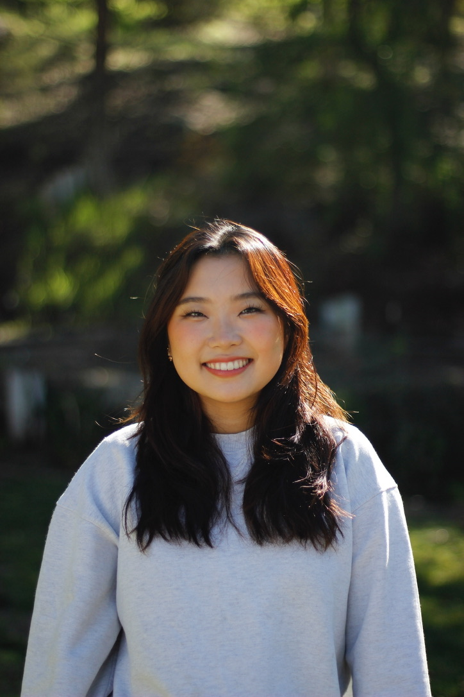

# About me

## **Hi, I'm Jisol Park!**



## Education
I am currently a third year *Math CS* major at **UCSD**. Here is my 
[LinkedIn](https://www.linkedin.com/in/jisol-park/).

### CSE cources
- [x] CSE 8A/8B
- [x] CSE 12/15L
- [x] CSE 30
- [x] CSE 100
- [x] CSE 105 
- [x] CSE 110
- [ ] CSE 101


***Interests***

- Snowboarding
- Pottery
- Reading

***Favorite Programming Language***
1. C++
2. Java
3. Python

Some commands I used to make this 
```
touch file_name
vi file_name
```

My favorite quote to say is 
> It be like that.

[README for Lab 1](README.md)


[About Me](#about-me)
